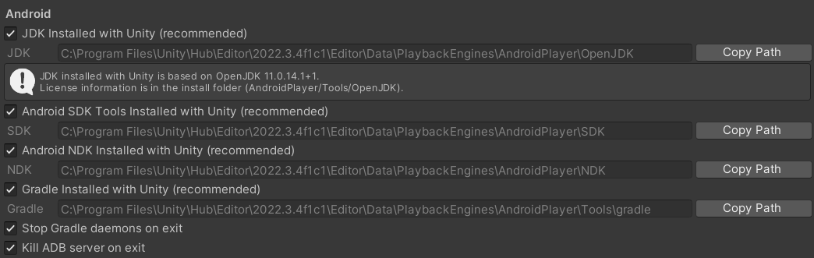

An example of building communication of java, c# and cpp.

## Create unity project and make android build

Unity version 2022.3.4. Configure android build tool chain.



## Build example aar

Create a new android project in android studio, choosing no activity template.

Configure SDK path and NDK path in local.properties, which will be ignored in git ignore file.

``` kotlin
sdk.dir=D\:\\AndroidSDK
ndk.dir=D\:\\AndroidSDK\\ndk
```

Configure gradle java jdk in File -> Project Structure -> Gradle Setting. Choosing JDK17 which is required by AGP 8.0.

In build.gradle, set compile sdk and target sdk to 33, these parameters will not make any influence to runtime application. Then set min sdk to 26, which means out arr only support android version above android 8 (Oreo).

Then set ndk version to 25, and set Java 8 compatibility.

``` gradle
android {
    compileSdk = 33

    defaultConfig {
        minSdk = 26
        targetSdk = 33
    }

    compileOptions {
        sourceCompatibility = JavaVersion.VERSION_1_8
        targetCompatibility = JavaVersion.VERSION_1_8
    }

    ndkVersion = "25.1.8937393"
}
```